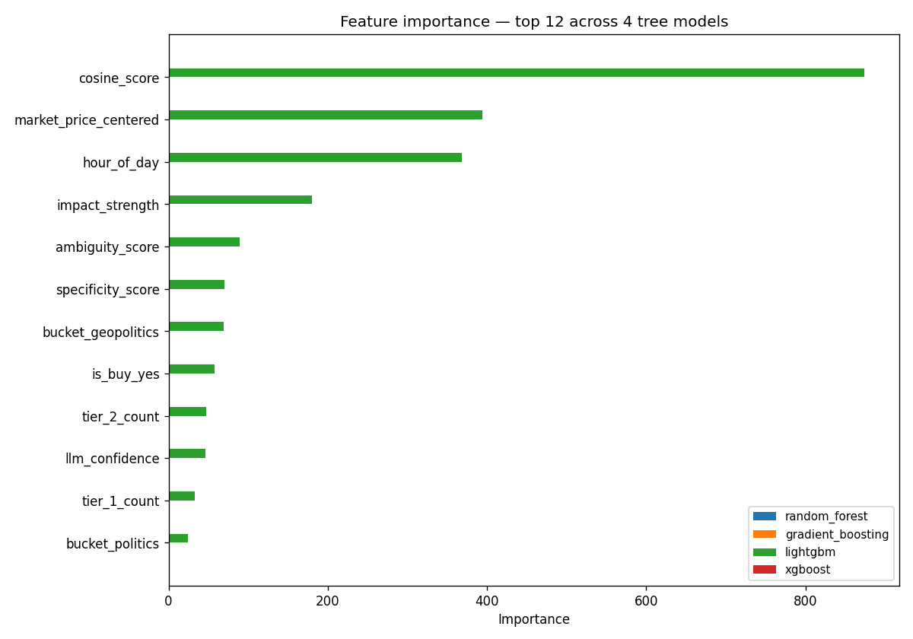

# ml-foresight

POC de ML pour [Foresight](https://github.com/vcapton-jpg/polymarket-ai), mon projet de signaux de trading sur Polymarket. L'idée : remplacer la formule de scoring heuristique actuelle par un modèle entraîné sur les signaux historiques.

Calqué sur la structure de [basile-desjuzeur/ml-poc-project](https://github.com/basile-desjuzeur/ml-poc-project).

## Le problème

Foresight émet des signaux notés 0–100 par une formule fixe. Sur 2 mois de prod, le winrate à T+24h est à 46–48 %, sous le hasard. On veut tester si un modèle ML peut faire mieux.

**Tâche** : classification binaire — étant donné un signal qui vient d'être émis, prédire si le marché va effectivement bouger dans la direction prédite à T+24h (`direction_correct`).

## Résultats (v1.4.0 — données prod au 2026-05-19)

855 signaux exploitables (35 jours de prod Hetzner), split 80/20, **test set N=171**. 6 modèles ML comparés + heuristique baseline. Export enrichi (39 colonnes : trajectoire de prix complète, microstructure marché) pour l'analyse, mais le ML reste sur un **allowlist strict de 19 features** (anti-leak).


| Modèle | Accuracy | F1 | ROC-AUC |
|---|---|---|---|
| Heuristique Foresight | 0.544 | 0.602 | 0.545 |
| **Random Forest** ★ | 0.573 | 0.568 | **0.573** |
| XGBoost | 0.538 | 0.573 | 0.539 |
| LightGBM | 0.532 | 0.556 | 0.532 |
| Gradient Boosting | 0.509 | 0.553 | 0.509 |
| SVM (RBF) | 0.503 | 0.525 | 0.503 |
| Logistic Regression | 0.497 | 0.488 | 0.497 |

**Les deux findings honnêtes :**

1. **L'écart reste modeste.** Le best model bat l'heuristique de **+2.8 pts ROC-AUC** (0.573 vs 0.545). En v1.2.0 (test N=78) c'était +3.7 pts, en v1.3.0 (test N=163) +0.3 pts. Le ML égale l'heuristique sans la dominer franchement.

2. **Le best model change selon le refresh** (GBM en v1.2/v1.3 → Random Forest en v1.4). Quand le signal est aussi faible, le classement des modèles est instable d'un dataset à l'autre. C'est en soi une leçon : ne pas sur-interpréter "tel modèle est le meilleur" sur un signal proche du hasard.

Le winrate global des signaux est de **49.9 %** (proche du hasard) — prédire la direction d'un marché quasi-efficient à 24h est intrinsèquement dur. Le projet a sa vraie valeur dans la **démarche** : pipeline reproductible, anti-leak par allowlist, honnêteté sur l'instabilité.





## Quickstart

```bash
# Setup
conda create -n ml-foresight python=3.11 -y
conda activate ml-foresight
pip install -r requirements.txt

# Si tu as accès à la DB Foresight, exporte les données
echo "FORESIGHT_DB_DSN=postgresql://..." > .env.local
python scripts/export_from_foresight.py

# Sinon, le sample anonymisé de 50 lignes dans data/raw/ suffit pour tester

# Entraîne les 3 modèles
python scripts/train.py

# Lance l'évaluation + dashboard Streamlit
python scripts/main.py
# → http://localhost:8501
```

## Structure

```
scripts/
  main.py                       # fixé Basile : eval + lance Streamlit
  train.py                      # notre code : entraîne LogReg + RF + GBM
  export_from_foresight.py      # SQL → CSV (notre code)
src/
  config.py    data.py          # contrats Basile, adaptés au projet
  metrics.py   app.py
  model_io.py  results.py       # fixés Basile
  __init__.py
plots/                          # générés par train.py, commités
docs/
  rapport.md                    # rapport académique
  specs/                        # design doc
```

## Architecture (3 repos)

- [ml-foresight](https://github.com/foresight-ml-poc/ml-foresight) (ici) — pipeline ML
- [backend-foresight](https://github.com/foresight-ml-poc/backend-foresight) — FastAPI qui sert le modèle
- [frontend-foresight](https://github.com/foresight-ml-poc/frontend-foresight) — démo React

Le modèle entraîné + scaler + model_card.json sont publiés en [GitHub Release v1.1.0](https://github.com/foresight-ml-poc/ml-foresight/releases/tag/v1.1.0). Le backend les télécharge au startup.

## Notes

- Le 3e modèle prévu était un MLP Keras mais TensorFlow se bloquait sur cet env (Apple Silicon, TF 2.21). Substitué par GradientBoosting — détails dans [`docs/rapport.md`](docs/rapport.md).
- v1.0.0 était capée à 40 samples car on joignait `event_market_features` (table populée seulement depuis 2026-04-27). v1.1.0 lève cette contrainte en utilisant directement le `signal_score` de Foresight comme baseline.

Voir [`docs/rapport.md`](docs/rapport.md) pour les détails et limitations.
