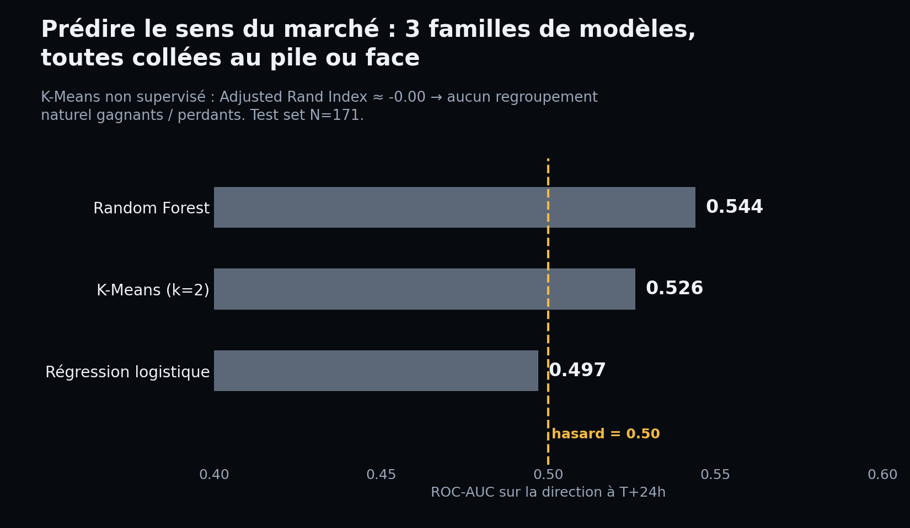
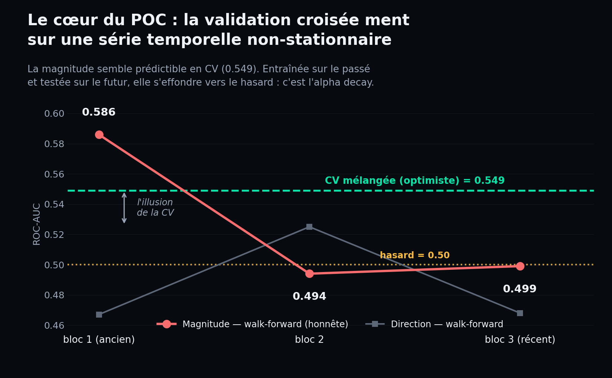
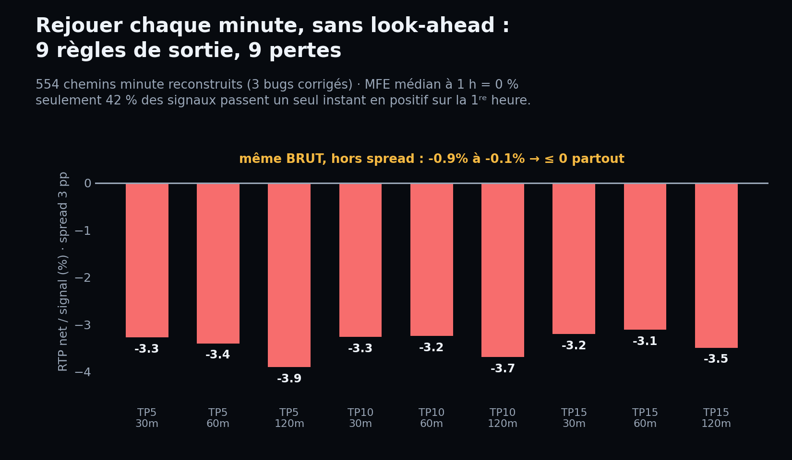
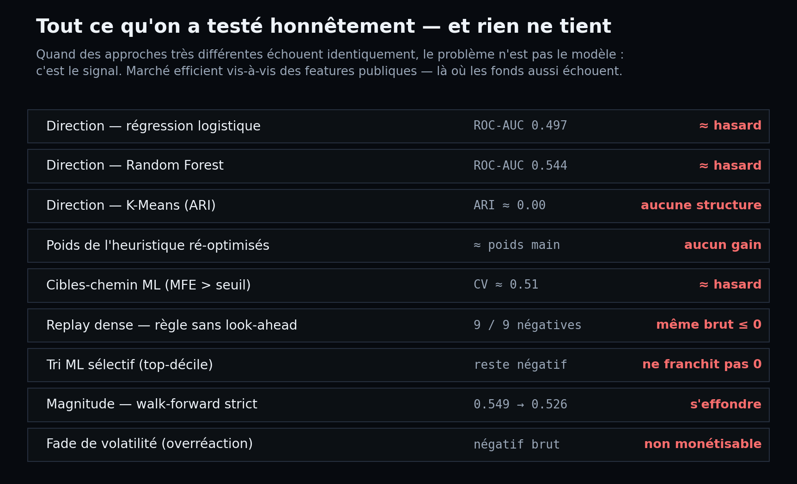

# ml-foresight — peut-on prédire un marché de prédiction ?

POC Machine Learning · Albert School · Vadim Capton
Structure calquée sur [basile-desjuzeur/ml-poc-project](https://github.com/basile-desjuzeur/ml-poc-project).

> **Réponse en une phrase.** Non — et c'est ce résultat négatif, établi
> rigoureusement, qui fait la valeur du projet. La direction d'un marché est
> un pile ou face (marché efficient) ; le seul signal qui *semblait* vivant
> (la magnitude) est une **illusion de la validation croisée** : il
> s'effondre dès qu'on teste sur le futur.

---

## 1. Le produit en 30 secondes

[Foresight](https://yourforesight.com) est un produit réel : il surveille
l'actualité en continu et, dès qu'une news touche un **marché de prédiction**
Polymarket (« La Fed baisse-t-elle ses taux en septembre ? » → on achète OUI
ou NON, le prix = la probabilité), il émet un **signal** noté 0–100 par une
formule heuristique : direction (BUY_YES / BUY_NO) + score.

**La question de ce POC :** cette heuristique faite main, peut-on faire mieux
avec du Machine Learning ? Concrètement — *prédire si un signal ira dans le
bon sens à T+24h* (`direction_correct`, classification binaire).

## 2. Les données — vraies, de production

- **855 signaux** exploitables exportés de la prod (Postgres, 35 jours), 39 colonnes.
- **Anti-fuite par allowlist explicite** (`src/config.py`) : seules les ~19
  variables connues *au moment du signal* entrent dans `X`. Les prix futurs,
  l'issue du marché, le score heuristique ne *peuvent pas* fuiter, même si on
  enrichit le CSV.
- Split 80/20 stratifié, scaler ajusté sur le train uniquement.

## 3. Le résultat honnête

### 3.1 Les 3 familles de modèles imposées : toutes ≈ pile ou face



| Modèle | Famille | ROC-AUC (test) |
|---|---|---|
| Régression logistique | linéaire | **0.497** |
| Random Forest | ensemble d'arbres | **0.544** |
| K-Means (k=2) | non supervisé | **0.526** · ARI ≈ **0.00** |

Le K-Means est la preuve la plus parlante : sans jamais voir le label, il ne
forme **aucun cluster** qui s'aligne sur gagnants/perdants (Adjusted Rand
Index ≈ 0). Il n'y a pas de structure cachée à trouver.

### 3.2 Le cœur du POC : la validation croisée *ment*



La **magnitude** (« ce marché va-t-il beaucoup bouger ? ») semblait
prédictible : **ROC-AUC 0.549 en validation croisée 5-fold**. Mais la CV
mélange passé et futur. En **walk-forward strict** (on entraîne sur le passé,
on teste sur le futur), elle s'effondre : `0.586 → 0.494 → 0.499`,
**sous le hasard sur la période récente**.

> C'est de l'**alpha decay** / de la non-stationnarité, vécu sur données
> réelles. La leçon ML centrale du projet : **sur une série temporelle, la
> validation croisée standard est une mesure invalide** — il faut le
> walk-forward.

### 3.3 Même au grain de la minute, sans tricher : rien



On a reconstruit le prix **minute par minute** de 554 signaux (API
Polymarket) et appliqué une règle de sortie **sans look-ahead** (entrer au
signal, sortir au premier instant en profit, sinon à l'horizon). Les 9
variantes testées sont **toutes perdantes — et perdantes même brut, hors
coûts**. Le MFE médian à 1 h est de 0 %.

Trois bugs de mesure ont été trouvés et corrigés en route (marchés déjà
résolus inclus ; les 53 % de signaux BUY_NO mesurés sur le mauvais token ;
l'API qui renvoyait 37 jours au lieu de 24 h). **Après correction, le
résultat négatif est plus solide, pas moins** — ce n'était pas un artefact.

### 3.4 Tout ce qu'on a testé



Quand des approches très différentes échouent **identiquement**, le problème
n'est pas le modèle : c'est le signal.

## 4. Pourquoi — l'efficience de marché, simplement

Un marché de prédiction intègre l'**information publique en secondes**. Notre
boucle news → LLM → score met des minutes : on arrive *après* le repricing
(d'où le MFE médian à 1 h = 0 %). Les fonds qui gagnent ont des avantages
**structurels** que Foresight n'a pas *via le ML* : la **vitesse**
(millisecondes), des **données propriétaires** (nos features sont publiques
et recalculables par tous → déjà dans le prix), l'**échelle**, ou le
**market-making** (être teneur, pas preneur). On échoue exactement là où la
plupart des fonds échouent aussi : prédire le sens à partir d'info publique.

## 5. Pourquoi c'est un bon POC (et pas un échec)

- Un **résultat négatif rigoureux** vaut mieux qu'un faux positif fragile
  qu'un jury démonte en 30 s.
- La **CV invalide sur série temporelle**, *démontrée* (0.549 → 0.526) et pas
  récitée — concept ML avancé, sur données réelles.
- Pipeline **anti-fuite par allowlist**, **no-look-ahead**, discipline
  **multi-tests**, **ARI** non supervisé.
- **3 bugs** de mesure trouvés et corrigés (l'intuition métier qui contredit
  le modèle, puis la donnée qui tranche).
- **Efficience de marché démontrée** empiriquement sur de la donnée de prod.

## 6. Reproduire

```bash
conda create -n ml-foresight python=3.11 -y && conda activate ml-foresight
pip install -r requirements.txt

# Un échantillon anonymisé est fourni dans data/raw/ ; avec accès DB :
#   python scripts/export_from_foresight.py

python scripts/train.py            # 3 modèles + CV vs walk-forward + model_card
python scripts/honest_analysis.py  # consolide results/final_honest_verdict.json
python scripts/make_figures.py     # régénère les 4 figures de plots/
python scripts/main.py             # éval (contrat Basile) + dashboard Streamlit

pytest -q                          # 18 tests (data + metrics)
```

## 7. Structure

```
scripts/
  main.py               # fixé Basile : éval des 3 modèles + lance Streamlit
  export_from_foresight.py   train.py   honest_analysis.py   make_figures.py
  exploration/          # études rigoureuses (reproductibilité du verdict) :
                        #   dense_replay_fixed, magnitude_monetize,
                        #   ml_signal_triage, optimize_heuristic, …
src/
  config.py  data.py  metrics.py  app.py     # contrats Basile (adaptés)
  model_io.py  results.py  __init__.py       # fixés Basile
models/   model_card.json + logreg/random_forest/kmeans .joblib
plots/    fig1..fig4 (générées, commitées)
results/  *.json — dont final_honest_verdict.json (la synthèse)
docs/     rapport.md (rapport académique honnête)
```

## 8. Architecture (3 repos)

- **ml-foresight** (ici) — le pipeline ML et le verdict
- [backend-foresight](https://github.com/foresight-ml-poc) — FastAPI de service
- [frontend-foresight](https://github.com/foresight-ml-poc) — démo

## 9. Engagement d'honnêteté

Aucun edge fabriqué. Toutes les pistes proposées ont été testées avec la même
rigueur. La recherche s'arrête volontairement ici : continuer à chercher un
résultat positif sur ce signal serait du p-hacking. Détails et limites dans
[`docs/rapport.md`](docs/rapport.md).
